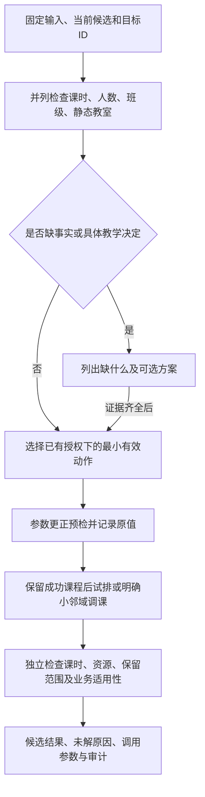

# 从失败原因到可验证修复：排课方法论

本方法已整理进仓库技能 `.agents/skills/timetable-repair/`，供agent按需读取错误模式、工具参数与真实案例。方法的关键是：先确定课程为什么失败，再选择对这个原因有效的动作；每次改变都有证据和边界，并保留已经成功的安排。

## 先分清四类事情

| 类别 | 本项目例子 | 如何记录 |
|---|---|---|
| 数据核查与更正 | 隔离冗余缺周行；核实人数上限和实际人数 | 保存原字段、源行、证据和更正前置条件；缺失事实保持未知 |
| 教学计划或验证范围选择 | 保持LLXS重新分配周负荷；逐课授权免查班级 | 记录这是明确选择的方案或检查范围，不写成唯一历史事实 |
| 模型表达扩展 | 支持集中授课、多块/天、偶数起点单节 | 参数说明允许表达什么，仍保持课时、硬禁排及资源检查 |
| 搜索与优化 | 固定占用预筛、小邻域补排、最小扰动、质量比较 | 报告相同输入/候选域下的效果、预算与截断；不冒充数据修正的收益 |

例如，176→184包含班级检查范围变化，不能作为“在相同约束下算法又多排了8门”的证据。既有课表有记录，也不等于这些记录已满足完整课时或实际场地需求。

## 诊断与执行流程

一门课程可以有多个阻塞原因。引擎先报班级错误时，不能漏掉它同时没有教室或课时不守恒；取消班级检查后出现另一个状态，通常是原有问题显露，不一定是修改制造了新错误。

“静态教室候选”指还没考虑空闲时段，先满足启用、校区、容量、必要类型、指定房间等条件的教室。该集合为空时，加夜间、加周末、挪旧课或增加搜索时间，都不能在同一库存和要求下创造一个合适教室。集合非空后，才进入时间和资源占用的联合搜索。

## 已沉淀的修复规则

| 问题模式 | 对应方法/接口 | 何时可以使用 | 必须验证什么 |
|---|---|---|---|
| 人数口径异常 | `set_capacity` | 真实人数有依据，并确认是冻结后采用的容量口径 | 修改需求而非教室容量；重算静态候选，再整批试排 |
| 缺合适类型/大教室 | 核实库存、设备、替代场地或正式分班方案 | 有真实供给或教学决定；当前无直接执行此类更正的接口 | 新输入版本、真实容量和用途、学生/教师分配及完整课时 |
| 班级泛指/缺失 | `replace_classes` 或授权 `set_class_conflict_check` | 前者有完整真实映射；后者有指定ID的免查授权 | 源开关与内部语义一致；不连带关闭其他检查；披露学生冲突未验证 |
| 总量与周学时不一致 | `redistribute_hours` | 已选定LLXS为总量及具体分周策略 | 保持全部原周和总学时，逐周正整数；不重复虚班继承的母课学时 |
| 零周学时但有一次课 | `set_one_off_week` | 原周域内的具体授课周已确认 | 所选周、块长、LLXS及教师责任周 |
| 多余缺周行冻结占用 | `quarantine_incomplete_segments` | 其余有效行已经满足每周负荷和全部LLXS | 只隔离冗余坏行，保留所有有效安排 |
| 工作日难排 | `repair_with_fallbacks` | 已授权晚间/周末且有静态教室候选 | 阶段只扩至调用方许可域，仍守硬禁排和明确周末限定 |
| 集中课被8学时或每日块数上限挡住 | `max_weekly_hours`、`max_blocks_per_day` | 教学计划确需更大周负荷或多块/天 | 每周及总量完整，不能只截成模型原先支持的8学时 |
| 0移动生成候选太慢 | `filter_fixed_occupancy` | 所有既有安排都固定、移动预算0 | 属于预筛加速；不能混用于释放同一占用的解释或移动搜索 |
| 已有占用阻塞新课 | `explain_conflict` → `optimize_local_repair` | 候选域及解释范围明确，有授权的可动课程 | 解释的释放假设不当作调课结果，所有旧课必须完整排回 |
| 想减少晚间/周末或调课成本 | `quality_frontier` | 同候选域、同补排数量和共享预算 | 明确权重、移动数量和质量分项，披露候选截断 |
| 修改后继续补排 | `retry_repair_proposal` / `extend_repair_proposal` | 前者为种子失败子集；后者为显式新增目标 | 源哈希、完全相同的修正前缀、全部旧成功安排保持 |

更正操作包含 `course_id`、原值前置条件、参数新值和 `evidence`；不是让agent生成任意Python改表。工具只执行确定性的有限动作，拒绝越界字段、无效类型、原值不符或不兼容的种子。当前为11个工具、6种更正操作，详细字段见 [Agent工具接口](Agent排课工具接口.md)。

## 三篇论文在方法中的位置

**QuickXplain用于解释。** 先寻找能复验的冲突约束子集，再判断它指向真实资源冲突还是数据异常。私人教练案例得到运动生理学占用的极小核；核实其余记录已满足36学时后，才隔离2条冗余空周行并重试。解释器本身没有自动删课或放宽规则。

**Phillips的最小扰动思路用于修复。** 在明确的小范围中先争取完整补入更多课程，再减少已有课程移动；邻域外课程固定。当前实现用有限候选回溯搜索，不是原论文MIP复现。

**Lindahl的质量恢复思路用于权衡。** 在补排数和候选域相同的条件下，比较允许调几门课能否减少夜间、周末或偏好损失。本项目真实单课案例的移动预算0和1结果相同，且可动集合为空，因此尚不能作为“移动越多质量越好”的实证。

三者都需要准确的输入和明确的模型；不会自动补出学生名单、冻结人数或缺失教室。论文对应实现及来源见 [三篇论文接入设计](三篇论文接入设计.md)。

## 当前35门适合怎样继续

25门适合优先核实人数口径：代入原表实际人数时已有静态教室候选，但尚未确认这些人数已冻结，不能承诺25门都能排入。确认后可将逐课 `set_capacity` 追加到最新184门种子的更正列表，用 `retry_repair_proposal` 保留全部旧成功再重试。其中职场礼仪还需同时处理周学时矛盾。

10门是设施供给问题：6门北校区缺必要类型，4门南校区同类型教室太小，即使用原表实际人数也无候选。要核实真实库存、设备适配或教学允许的类型/校区替代，或制定正式分班方案；音乐美学一班另有学时矛盾。单纯改时间不会解决。

2门学时问题与前两组重叠，不另加到35：音乐美学16总学时但2×9=18；职场礼仪11总学时但2×6=12。保持原周和LLXS时，可分别安排“7周×2＋2周×1”和“5周×2＋1周×1”，但具体低负荷周须依据教学计划选择。

另4门高水平队在184技术候选内，场地与运动项目不适配，必须单列待核；不能把它们塞进失败重试工具，该接口会拒绝已成功目标。当前没有“载入完整种子、只调整指定已排课场地”的接口。这是后续工具应补齐的能力，不是已完成的方法。

## 后续工具扩展的明确边界

下面是设计需求，尚未声称实现或执行：

| 能力 | 应显式传入 | 应有的验收 |
|---|---|---|
| 经核实的场地要求更正 | 教学班ID、原校区/类型/场地白名单、确认后的值及设备依据 | 不伪造场地或抬高真实容量，输出数据版本与规则差异 |
| 已成功种子的局部场地修复 | 完整种子、只允许修改的课程集合、场地要求、移动上限和其余锁定集合 | 原目标范围保持、未授权安排逐行不变、修改课程完整课时及全批次冲突复验 |
| 正式分班 | 母课ID、每个子班真实学生集合/人数、教师、课时与周次分配 | 学生覆盖且按业务规则避免遗漏/重复，母课总量不被复制，资源与教学计划一致 |

补充房间库存或改变源数据会改变哈希，当前旧种子不能直接跨版本续排；需要显式版本迁移与验证，不能篡改旧哈希绕过检查。

## 完成标准与实验记录

每次交付至少回答：哪些ID真的新增、哪些旧安排改变、哪些检查被排除、课时是否完整、仍有哪些原因、业务适用性是否已核实。保存源/更正哈希、调用参数、逐课修改审计、完整候选和独立核验；人数、场地或学生关系未确认时清楚标记。

论文实验将数据修正、授权扩域、集中课表达与优化算法分别列组，再报告完整补排数、移动数、课时保持、质量、耗时、截断及UNKNOWN比例。失败清单与未确认业务范围分开，不能删除困难课程来提高成功率。
